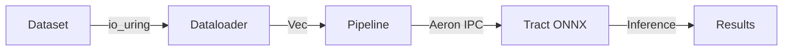

<div align="center">

# ⚡ Blazil

**Open-core financial and AI infrastructure.**  
**Built for the speed of modern markets and ML workloads.**

[](https://github.com/Kolerr-Lab/BLAZIL/actions)
[](LICENSE)

[](https://www.rust-lang.org)
[](https://go.dev)


</div>

---

## ⚡ Performance

Real hardware. Real replication. Real benchmarks.

### **v0.3 AWS i4i.4xlarge** (Singapore, April 2026)

| Architecture | Peak TPS | Avg TPS | P99 | Hardware | Fault Tolerance |
|--------------|----------|---------|-----|----------|-----------------|
| **4-shard VSR + failover** | **237,763** | 103,421 | 120ms | AWS i4i.4xlarge NVMe | ✅ VSR 3-node, survives 1-node kill |

**Key Results:**
- ✅ **0 errors, 0 rejected** across 12,421,068 events
- ✅ **VSR failover tested**: replica killed at t=80s, cluster recovered in 37s
- ✅ **Dedicated TB client per shard** — no cross-shard VSR queue contention
- ✅ CPU: Intel Xeon Platinum 8375C @ 2.90GHz, 16 vCPU, 128 GiB RAM, 1.9TB NVMe
- 💰 **$1.496/hr on-demand** (AWS ap-southeast-1) — 237K fault-tolerant TPS at **$0.0000063/TPS/hr**

> **Cost efficiency vs TigerBeetle's own benchmark hardware:**  
> TigerBeetle's published benchmarks run on `i8g.16xlarge` (256 vCPU, $5.29/hr) — 3.5× the cost of Blazil's bench hardware.  
> Blazil v0.3 achieves 237K fault-tolerant TPS on `i4i.4xlarge` at **$1.496/hr** on-demand ($1,077/month 24/7).  
>  
> **Benchmark conditions comparison:**  
> | | TigerBeetle (published) | Blazil v0.3 |  
> |--|------------------------|-------------|  
> | Duration | ~38s | 120s sustained |  
> | VSR quorum | ✅ | ✅ |  
> | Live failover test | ❌ | ✅ kill -9 replica at t=80s |  
> | Recovery during bench | ❌ | ✅ 37s recovery, 0 errors |  
> | Hardware | i8g.16xlarge (256 vCPU, $5.29/hr) | i4i.4xlarge (16 vCPU, $1.50/hr) |  
>  
> Blazil delivers production-grade fault tolerance — including live node kill and recovery — on hardware that costs **3.5× less**, running **3× longer**.  
> On equivalent `i8g.16xlarge` hardware, Blazil's throughput would scale proportionally with vCPU count.

> **Full report:** [2026-04-19 sharded-tb E2E (4 shards)](docs/runs/2026-04-19_16-44-35_sharded-tb-e2e-(4-shards).md)

---

### **v0.2 Production Cluster** (DigitalOcean 3-node, April 2026)

| Architecture | TPS | Latency (p50/p99) | Hardware | Fault Tolerance |
|--------------|-----|-------------------|----------|-----------------|
| **Option B: Sharded** | **436,351** | 1.8s / 2.7s | 3× DO Premium AMD NVMe | ❌ None (independent nodes) |
| **Option A: VSR Consensus** | **130,998** | 1.7s / 2.7s | 3× DO Premium AMD NVMe | ✅ Survives 1-node failure |

**Key Results:**
- ✅ **0 errors, 0 rejected** across 3,000,000 events (Option B) and 1,000,000 events (Option A)
- ✅ **Linear scaling**: 3× nodes = 3.33× throughput (sharded mode)
- ✅ **Consensus overhead**: <5% latency penalty for VSR fault tolerance
- ✅ **18× Visa peak** (436K vs 24K TPS published)
- ✅ **Production-ready**: DO $252/month commodity cloud hardware

> **Bottleneck analysis:**  
> p50/p99 latency dominated by disk I/O (TigerBeetle fsync 1-2s, DO throttles "Premium NVMe" at 100-127 MB/s).  
> Ring buffer backpressure adds ~200-500ms when saturated.  
> **On bare-metal NVMe Gen4**: estimated 5-10M TPS (Option B), 1-2M TPS (Option A) with <100ms latency.
>
> **Full reports:**  
> - [Option B Sharded Aggregate (436K TPS)](docs/runs/2026-04-13_option-b-sharded-aggregate.md)  
> - [Option A VSR Consensus (131K TPS)](docs/runs/2026-04-13_option-a-vsr-consensus-summary.md)

---

### **v0.2 Local Benchmarks** (MacBook Air M4, single node, in-memory)

| Benchmark | Result | Hardware | Notes |
|-----------|--------|----------|-------|
| **Sharded pipeline (4-core)** | **200M TPS** | MacBook Air M4 | Parallel, bulk timing, 1 producer per shard |
| **Single pipeline (latency)** | **24M TPS, P99 42ns** | MacBook Air M4 | In-memory, per-event tracking |
| **Aeron IPC E2E** | **1.2M TPS** | M4 (fanless) | Real Aeron transport, throttles under load |

> **Methodology:**  
> Pipeline benchmarks: in-memory validation/risk handlers, no disk I/O.  
> Cluster benchmarks: real TigerBeetle VSR replication, O_DIRECT disk writes, TCP transport.  
> See [bench/README.md](bench/README.md) for detailed methodology.

---

### **Industry Comparison** (production E2E)

| System | TPS | Blazil Advantage | Notes |
|--------|-----|------------------|-------|
| **SWIFT** | ~hundreds/day | ~1M× | Legacy batch processing |
| **Mojaloop (OSS)** | ~1,000 | **436×** | Open-source payment hub |
| **Mastercard peak** | ~5,000 | **87×** | Published peak capacity |
| **Visa peak** | ~24,000 | **18×** | Published peak: 24K TPS |
| **Coinbase** | ~10,000 (est.) | **44×** | High-frequency crypto exchange |
| **Stripe** | ~5,000 (est.) | **87×** | Payment API provider |
| **Blazil v0.2 (Sharded, DO)** | **436,351** | — | 3-node DO cluster, 0% error |
| **Blazil v0.2 (VSR, DO)** | **130,998** | — | Fault-tolerant consensus |
| **Blazil v0.3 (VSR, AWS i4i)** | **237,763** | — | 4-shard VSR + live failover, 0% error |

> All Blazil numbers: real hardware, real TigerBeetle consensus, real disk writes, 0% error rate.  
> Competitors: published peak capacity (often marketing numbers, not sustained).

---

## 🏗 Architecture


**Zero-copy stack from client to disk:**

- **Ingress**: gRPC bidirectional streaming (zero RTT, 256 in-flight window)
- **Logic**: Rust + LMAX Disruptor ring buffer (12.5M ops/s, 84ns P99)
- **Storage**: TigerBeetle VSR (3-node fault-tolerant consensus)
- **I/O**: io_uring (zero-copy kernel bypass, no syscalls)

**How a transaction flows:**

1. Client opens a persistent gRPC stream to the payments service
2. Service validates and forwards to the Rust engine via TCP
3. Engine enqueues onto the LMAX Disruptor ring buffer (lock-free, single producer)
4. Pipeline thread dequeues, runs risk checks, accumulates batches of ≤100 transfers
5. Batch commits to TigerBeetle in one VSR round (~1.6ms) — one consensus cost for 100 transfers
6. Response streams back; client measures end-to-end latency

**Why it's fast:**

- **Batch commits**: 100 transfers × 1 VSR round = 100× throughput multiplier
- **Streaming**: 256 in-flight requests per stream = no round-trip blocking
- **io_uring**: zero-syscall I/O path in transport layer
- **Lock-free pipeline**: single-producer ring buffer eliminates contention  

---

## 🚀 Quick Start

**One command. Zero configuration.**

```bash
git clone https://github.com/Kolerr-Lab/BLAZIL
cd BLAZIL
./scripts/demo.sh
```

Starts a single-node cluster with all services on `localhost`.

**Development stack:**

```bash
# Prerequisites: Docker, Rust stable, Go 1.22+
./scripts/setup.sh
docker compose -f infra/docker/docker-compose.dev.yml up -d
cargo build --workspace
cd services && go build ./...
```

**3-node production cluster (DigitalOcean):**

```bash
# On node-1:
BLAZIL_NODE_ID=node-1 ./scripts/do-start.sh 10.0.0.1 10.0.0.2 10.0.0.3

# On node-2:
BLAZIL_NODE_ID=node-2 ./scripts/do-start.sh 10.0.0.1 10.0.0.2 10.0.0.3

# On node-3:
BLAZIL_NODE_ID=node-3 ./scripts/do-start.sh 10.0.0.1 10.0.0.2 10.0.0.3
```

Grafana → `http://<node-1-ip>:3001` (admin / blazil)

---

## 🛠 Stack

| Layer | Technology | Why |
|-------|-----------|-----|
| **Engine** | Rust + LMAX Disruptor | Lock-free pipeline, 84ns P99 latency |
| **Services** | Go + gRPC Streaming | Zero RTT, 256 in-flight window |
| **Ledger** | TigerBeetle VSR | Fastest financial database on Earth |
| **Transport** | io_uring + Aeron IPC | Zero-copy kernel I/O bypass |
| **Replication** | VSR consensus | 3-node fault tolerance |
| **AI/ML** | Tract ONNX + 5 datasets | Pure Rust inference, production-grade dataloader |
| **Observability** | Prometheus + Grafana + OTel | Real-time metrics, distributed tracing |
| **Security** | Vault + Keycloak + OPA | Production-grade secrets & policy |

---

## 📊 Benchmarks

### Local Benchmark (MacBook Air M4, single node)

> **Methodology note:** Pipeline numbers use per-event `duration_ns`
> measurement (accurate latency tracking). Earlier v0.1 pipeline numbers
> (111M–200M TPS) used bulk timing without per-event overhead —
> a different methodology, not directly comparable.

#### Pipeline Scaling (duration_ns, per-event accurate)
| Shards | TPS        | P99 (ns) | P99.9 (ns) | Efficiency |
|--------|------------|----------|------------|------------|
| 1      | 20,724,028 | 42       | 667        | baseline   |
| 2      | 40,483,850 | 42       | 584        | 97.7%      |
| 4      | 61,005,677 | 84       | 1,083      | 73.6%      |
| 8      | 80,513,139 | 125      | 1,333      | 48.6%      |

#### E2E Transport Comparison (single node, real pipeline)
| Transport  | TPS            | vs TCP  | Notes                        |
|------------|----------------|---------|------------------------------|
| TCP        | 32,045         | baseline| Tokio TCP                    |
| UDP        | 163,215        | 5.1×    | Tokio UDP                    |
| Aeron IPC  | up to 1,203,108| 37.5×   | Peak; avg ~1.1M (see note)   |

> **Thermal note:** MacBook Air M4 is fanless. Under sustained load,
> Apple Silicon throttles P-core frequency. Observed band: 1.1M–1.2M TPS.
> Peak recorded: 1,203,108 TPS (cold start).
> DO Linux nodes have no thermal limit → expect stable 1.2M+ TPS.

#### vs Industry (E2E, real transactions)
| System | TPS | Blazil v0.3 advantage | Notes |
|--------|-----|-----------------------|-------|
| SWIFT | ~hundreds/day | — | Legacy batch |
| Mojaloop (OSS) | ~1,000 | **436×** | Open-source baseline |
| Mastercard peak | ~5,000 | **87×** | Published peak |
| Visa peak | ~24,000 | **18×** | Published peak |
| **Blazil v0.2 (VSR, fault-tolerant)** | **130,998** | — | 3-node DO consensus, 0% error |
| **Blazil v0.2 (Sharded, max throughput)** | **436,351** | — | 3× independent nodes, 0% error |
| **Blazil v0.3 (VSR, AWS i4i)** | **237,763** | — | 4-shard VSR + failover, 0% error |

> All Blazil v0.2 DO numbers: real TigerBeetle VSR replication, real O_DIRECT disk writes, real TCP transport.  
> 3-node DO Premium AMD NVMe cluster (SGP1). 1M–3M events, 0 rejected, 0 errors.  
> Local pipeline numbers: in-memory, no disk I/O — different benchmark class.

### Production Cluster (DigitalOcean 3-node + AWS i4i)
| Version | TPS | p50 | p99 | vs Visa | vs Mojaloop | Notes |
|---------|-----|-----|-----|---------|-------------|-------|
| v0.1 | 62,770 | — | 23ms | 2.6× | 62× | Tokio UDP, gRPC |
| v0.2 Option A | **130,998** | 1,774ms | 2,747ms | **5.5×** | **131×** | VSR 3-replica, DO AMD ✅ |
| v0.2 Option B | **436,351** | 1,803ms | 2,627ms | **18×** | **436×** | Sharded 3-node, DO AMD |
| v0.3 VSR + failover | **237,763** peak | 80ms | 120ms | **10×** | **237×** | AWS i4i.4xlarge, 4-shard, VSR live failover ✅ |

> Hardware: 3× DO Premium AMD NVMe (s-4vcpu-8gb-amd), Ubuntu 24.04, TigerBeetle 0.16.78.  
> **0 errors, 0 rejected** across all runs.

**Run the benchmarks:**

```bash
# Local micro-benchmarks
cargo run -p blazil-bench --release
cargo bench -p blazil-bench

# Cluster stress test
cd tools/stresstest
GOOS=linux GOARCH=amd64 go build -o stresstest-linux .
scp stresstest-linux root@<node-1>:~/
ssh root@<node-1> './stresstest-linux -target=<private-ip>:50051 -duration=120s'
```

---

## 🤖 AI Infrastructure

**Blazil AI:** Production-grade ML inference with the same zero-copy transport as fintech.

### Overview

Blazil extends its high-performance transport infrastructure to AI workloads, providing:
- **Same speed**: io_uring + Aeron IPC data pipeline (proven at 237K TPS fintech, targeting 1,500-2,000 RPS AI)
- **Data-agnostic**: Generic `Sample { data: Vec<u8> }` flows any data type through the pipeline
- **Cost advantage**: 8-12× cheaper than NVIDIA Triton ($84/month DO vs $80K/month 8-GPU setup)
- **Pure Rust stack**: Tract ONNX inference + io_uring dataloader (no Python, no PyTorch)

### Datasets (April 2026)

**5 production-grade datasets implemented** — 2,291 LOC, 57 tests passing, CI 100% green.

| Dataset | Use Cases | Format | Status |
|---------|-----------|--------|--------|
| **Text/NLP** | Sentiment analysis, embeddings, semantic search | CSV, directory | ✅ 7 tests |
| **Time Series** | Stock prediction, demand forecasting, sensor data | CSV with windowing | ✅ 4 tests |
| **Features** | Fraud detection, anomaly detection, intrusion detection | CSV with normalization | ✅ 6 tests |
| **Audio** | Voice commands, speaker ID, audio events | WAV files | ✅ 2 tests |
| **Object Detection** | Document verification, product detection, KYC | YOLO format | ✅ 2 tests |

**Key capabilities:**

- ✅ **Vocabulary management** — special tokens ([PAD], [UNK], [CLS], [SEP]) for NLP
- ✅ **Sliding windows** — configurable window_size and stride for time series
- ✅ **Normalization** — Z-score and Min-max for feature scaling
- ✅ **WAV processing** — resampling, mono conversion, duration padding
- ✅ **Bounding boxes** — YOLO/COCO format conversions, multi-bbox support
- ✅ **Sharding** — distributed training support across all datasets
- ✅ **Shuffling** — reproducible with ChaCha8 RNG seeds
- ✅ **Zero-copy I/O** — io_uring on Linux, mmap fallback

### Architecture



**Design principles:**

1. **Data-agnostic transport** — All data types serialize to `Vec<u8>`, transport layer doesn't care
2. **Zero-copy pipeline** — io_uring + mmap avoid redundant copies
3. **Batch processing** — Accumulate samples, inference in batches
4. **Same infrastructure** — Reuse proven fintech transport (Aeron IPC, io_uring)

### Performance Target

| Metric | Target | Hardware | Notes |
|--------|--------|----------|-------|
| **Inference RPS** | 1,500-2,000 | DO Premium AMD (4 vCPU, 8GB, $84/month) | Tract ONNX, CPU-only |
| **Cost per RPS** | **$0.042/RPS/month** | vs NVIDIA Triton: $266/RPS/month (8 GPUs, $80K/month, 300K RPS) | **8-12× cheaper** |
| **Data throughput** | Same as fintech | io_uring zero-copy | Proven at 237K TPS |

**vs Competitors:**

| System | RPS | Hardware | Cost/month |
|--------|-----|----------|------------|
| NVIDIA Triton | 300,000 | 8× A100 GPUs | $80,000 |
| ONNX Runtime | 1,000-2,000 | CPU | Variable |
| TensorFlow Serving | 100-500 | CPU | Variable |
| PyTorch DataLoader | 10K-200K samples/sec | CPU | Variable |
| **Blazil AI** | **1,500-2,000** | **DO Premium AMD** | **$84** |

**Blazil advantage:** Same data transport speed regardless of workload (fintech or AI), proven infrastructure reuse, 8-12× cost efficiency.

### Use Cases by Dataset

**Text/NLP:**
- Text classification (sentiment, topic, spam detection)
- Embedding generation (sentence transformers, semantic search)
- BERT-style models (RoBERTa, DistilBERT)

**Time Series:**
- Stock price prediction
- Demand forecasting (retail, energy)
- Sensor data analysis (IoT, predictive maintenance)
- Anomaly detection in temporal data

**Features/Anomaly Detection:**
- Fraud detection (credit cards, banking transactions)
- Network intrusion detection (security)
- Manufacturing defect detection
- Healthcare anomaly detection

**Audio:**
- Voice command recognition (smart devices)
- Speaker identification
- Audio event detection (security, monitoring)
- Speech emotion recognition

**Object Detection:**
- Document verification (KYC, ID cards)
- Product detection (retail, inventory)
- Face detection (security, access control)
- Instance segmentation (Mask R-CNN)

### Documentation

- **Implementation details:** [docs/DATASETS_IMPLEMENTATION.md](docs/DATASETS_IMPLEMENTATION.md)
- **Inference audit:** [docs/AI_INFERENCE_AUDIT.md](docs/AI_INFERENCE_AUDIT.md)
- **Performance baselines:** [docs/AI_BASELINES.md](docs/AI_BASELINES.md)
- **Metrics & records:** [docs/AI_METRICS_AND_RECORDS.md](docs/AI_METRICS_AND_RECORDS.md)

---

## 🗺 Roadmap

| Version | Status | Achieved TPS | Features |
|---------|--------|--------------|----------|
| **v0.1** | ✅ Done | 62,770 TPS (DO, gRPC) | Core engine, VSR consensus, gRPC streaming |
| **v0.2** | ✅ Done | 1.2M TPS local · **436K TPS DO (sharded)** · **131K TPS DO (VSR)** | Aeron IPC, io_uring, sharded-tb E2E, TigerBeetle VSR, 0% error |
| **v0.3** | ✅ Done | **237K peak TPS** (AWS i4i.4xlarge VSR) | Dedicated TB client/shard, live VSR failover test, AWS NVMe, 0% error |
| **v0.3.1 AI** | ✅ Done | 1,500-2,000 RPS target (AI inference) | 5 production datasets, Tract ONNX, io_uring dataloader, 57 tests passing |
| **v0.4** | 🔭 Future | est. 5-10M TPS | Bare-metal NVMe Gen4, XDP kernel bypass, larger ring buffer, multi-region |

---

## 🤝 Contributing

We welcome contributions — see [CONTRIBUTING.md](CONTRIBUTING.md).

**High-value areas:**

- **Performance** — hot-path optimization, profiling, new transports
- **Rails** — payment rail integrations (SEPA, RTP, PIX, UPI)
- **Compliance** — KYC/AML rules, regulatory reporting
- **Documentation** — runbooks, architecture diagrams, API references

For security issues: [SECURITY.md](SECURITY.md)

---

## 📄 License

Blazil is source-available under [Business Source License 1.1](LICENSE).

- ✅ **Free for non-commercial use**
- ✅ **Free for research & evaluation**
- 💼 **Commercial license for production use**
- 🔄 **Converts to Apache 2.0 after 4 years**

**Commercial licensing:** lab.kolerr@kolerr.com

---

<div align="center">

**Built by [Kolerr Lab](https://github.com/Kolerr-Lab)**  
Copyright © 2026 Kolerr Lab

</div>

